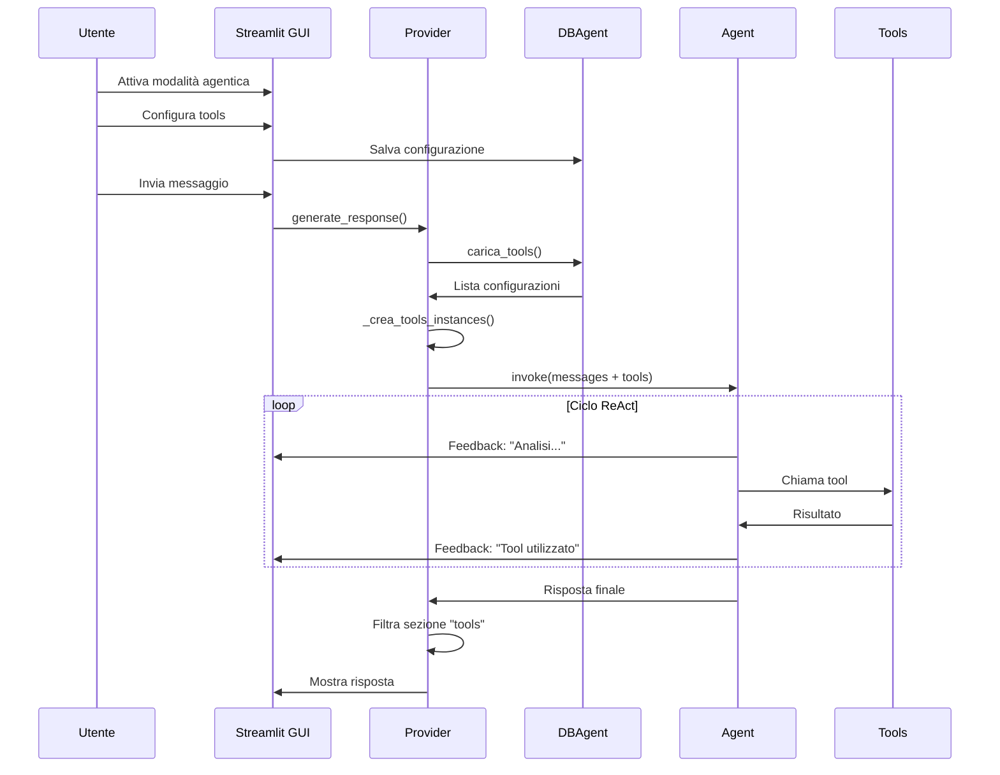

# 🤖 Implementazione Modalità Agentica - Documentazione

## 📋 Panoramica

Questo documento descrive l'implementazione completa della modalità agentica per DapaBot, che consente di utilizzare tools di LangChain per estendere le capacità del chatbot.

## 🏗️ Architettura

### Componenti Principali

1. **DBAgent** (`src/DBAgent.py`)
   - Gestisce il database SQLite3 per la configurazione dei tools
   - Carica dinamicamente i tools da `langchain_community.tools`
   - Fornisce metodi per salvare, caricare ed esportare configurazioni

2. **Provider** (`src/providers/base.py`)
   - Metodo `set_tools()`: imposta i tools per l'agent
   - Metodo `_crea_tools_instances()`: crea istanze dei tools dalla configurazione
   - Metodo `invia_messaggi()` modificato per supportare feedback visivo e tools

3. **GUI** (`src/gui_utils.py`)
   - Dialog `mostra_dialog_tools_agent()`: interfaccia per configurare i tools
   - Pulsante "⚙️" accanto al toggle modalità agentica
   - Feedback visivo con `st.status()` durante l'esecuzione dell'agent

## 🚀 Come Utilizzare

### 1. Attivare la Modalità Agentica

1. Nella sidebar, attiva il toggle **"Modalità agentica"**
2. Apparirà un pulsante **"⚙️"** accanto al toggle
3. Clicca sul pulsante per aprire il dialog di configurazione

### 2. Configurare i Tools

Nel dialog di configurazione:

#### Pannello Sinistro - Lista Tools
- Visualizza tutti i tools disponibili da LangChain
- Usa la barra di ricerca per filtrare i tools
- I tools già configurati sono evidenziati
- Clicca sul pulsante "⚙️" accanto a un tool per configurarlo

#### Pannello Destro - Configurazione Tool
- Mostra i parametri configurabili del tool selezionato
- I widget si adattano automaticamente al tipo di parametro:
  - **int/float**: `st.number_input`
  - **bool**: `st.checkbox`
  - **list**: `st.text_area` (valori separati da virgola)
  - **str**: `st.text_input`
- Clicca **"💾 Salva Tool"** per salvare la configurazione
- Clicca **"❌ Rimuovi Tool"** per eliminare un tool configurato

#### Gestione Database
- **📥 Importa**: carica una configurazione da file JSON
- **📤 Esporta**: scarica la configurazione corrente in formato JSON
- **🗑️ Elimina**: cancella tutto il database (richiede conferma)

### 3. Utilizzare l'Agent

1. Assicurati che la modalità agentica sia attiva
2. Configura almeno un tool
3. Invia un messaggio nella chat
4. Osserva il feedback visivo:
   - 🔧 Caricamento tools
   - 🧠 Analisi del problema
   - 🔧 Utilizzo dei tools specifici
   - ✅ Completamento operazioni

### 4. Feedback Visivo

Durante l'esecuzione, vedrai un widget `st.status()` che mostra:
- Numero di tools caricati
- Fase di analisi
- Ogni tool utilizzato dall'agent
- Stato di completamento

## 📊 Schema Database

### Tabella `tools`

```sql
CREATE TABLE tools (
    nome_tool TEXT PRIMARY KEY,
    configurazione TEXT NOT NULL,  -- JSON string
    data_creazione TEXT NOT NULL,
    data_modifica TEXT NOT NULL
);
```

### Formato Configurazione

```json
{
  "nome_tool": "WikipediaQueryRun",
  "configurazione": {
    "lang": "en",
    "top_k_results": 3
  }
}
```

## 🔧 Tools Supportati

Lista dei tools comuni supportati (se disponibili in `langchain_community.tools`):

### Ricerca e Informazioni
- **WikipediaQueryRun**: ricerca su Wikipedia
- **ArxivQueryRun**: ricerca articoli scientifici su ArXiv
- **DuckDuckGoSearchRun**: ricerca web con DuckDuckGo
- **TavilySearchResults**: ricerca web con Tavily
- **PubmedQueryRun**: ricerca articoli medici su PubMed
- **WolframAlphaQueryRun**: calcoli e query su Wolfram Alpha
- **GoogleSearchRun**: ricerca Google
- **BingSearchRun**: ricerca Bing
- **BraveSearch**: ricerca Brave
- **YouTubeSearchTool**: ricerca video su YouTube
- **RedditSearchRun**: ricerca su Reddit
- **StackExchangeTool**: ricerca su Stack Exchange

### Utilità
- **OpenWeatherMapQueryRun**: informazioni meteo
- **HumanInputRun**: richiede input umano
- **PythonREPLTool**: esegue codice Python
- **ShellTool**: esegue comandi shell

### File e Rete
- **RequestsGetTool**: richieste HTTP GET
- **RequestsPostTool**: richieste HTTP POST
- **FileManagementTool**: gestione file
- **ReadFileTool**: lettura file
- **WriteFileTool**: scrittura file
- **ListDirectoryTool**: lista directory

## 🔄 Flusso di Esecuzione



## 🛡️ Gestione Errori

### Errori Comuni

1. **Tool non trovato**
   - Causa: Il tool non è disponibile in `langchain_community.tools`
   - Soluzione: Verifica l'installazione di `langchain-community`

2. **Parametri non validi**
   - Causa: Parametri configurati non compatibili con il tool
   - Soluzione: Verifica la documentazione del tool specifico

3. **Agent non inizializzato**
   - Causa: Client LLM non configurato
   - Soluzione: Inserisci una API key valida e seleziona un modello

### Logging

Gli errori vengono stampati sulla console con il formato:
```
Warning: Tool 'NomeTool' non trovato
Errore nella creazione del tool 'NomeTool': <dettagli>
```

## 📝 Note Importanti

### Filtraggio Messaggi

- I messaggi intermedi dell'agent (tool calls) **non** vengono salvati nel database
- Solo la risposta finale viene memorizzata nella cronologia
- Questo evita di inquinare lo storico con messaggi tecnici

### Performance

- Il caricamento dinamico dei tools può richiedere qualche secondo
- I tools vengono caricati solo quando necessario
- La configurazione viene cachata per migliorare le prestazioni

### Sicurezza

- Alcuni tools (es. `ShellTool`, `PythonREPLTool`) possono eseguire codice
- Usa questi tools solo in ambienti controllati
- Valuta attentamente i permessi necessari

## 🧪 Testing

### Test Manuale

1. **Test Configurazione Tools**
   ```
   1. Attiva modalità agentica
   2. Apri dialog configurazione
   3. Seleziona "WikipediaQueryRun"
   4. Configura: lang="it", top_k_results=3
   5. Salva
   6. Verifica che il tool appaia come configurato
   ```

2. **Test Esecuzione Agent**
   ```
   1. Con WikipediaQueryRun configurato
   2. Invia: "Cerca informazioni su Albert Einstein"
   3. Osserva il feedback visivo
   4. Verifica che la risposta contenga informazioni da Wikipedia
   ```

3. **Test Import/Export**
   ```
   1. Configura alcuni tools
   2. Esporta configurazione
   3. Elimina database
   4. Importa configurazione
   5. Verifica che i tools siano ripristinati
   ```

### Test Automatici

Per implementare test automatici, considera:
- Test unitari per `DBAgent` (creazione, salvataggio, caricamento)
- Test di integrazione per il flusso completo
- Mock dei tools per evitare chiamate API reali

## 🔮 Estensioni Future

### Possibili Miglioramenti

1. **Cache Tools**
   - Cachare le istanze dei tools per evitare ricaricamenti
   - Implementare un sistema di invalidazione cache

2. **Tools Personalizzati**
   - Permettere l'aggiunta di tools custom
   - Interfaccia per definire nuovi tools

3. **Profili di Configurazione**
   - Salvare set di tools predefiniti
   - Cambio rapido tra profili

4. **Statistiche Utilizzo**
   - Tracciare quali tools vengono usati più spesso
   - Analisi delle performance dei tools

5. **Validazione Parametri**
   - Validazione avanzata dei parametri prima del salvataggio
   - Suggerimenti intelligenti per i valori

## 📚 Riferimenti

- [LangChain Tools Documentation](https://docs.langchain.com/oss/python/integrations/tools)
- [LangChain Agents](https://python.langchain.com/docs/modules/agents/)
- [Streamlit Documentation](https://docs.streamlit.io/)

## 🤝 Contribuire

Per contribuire all'implementazione:
1. Segui le convenzioni di codice esistenti
2. Aggiungi test per nuove funzionalità
3. Aggiorna questa documentazione
4. Testa accuratamente prima di committare

---

**Versione**: 1.0  
**Data**: 2026-02-06  
**Autore**: Bob (AI Assistant)