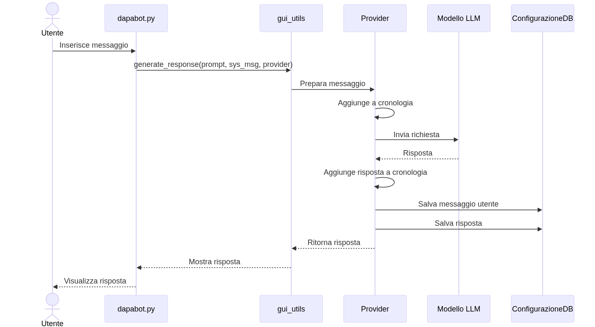
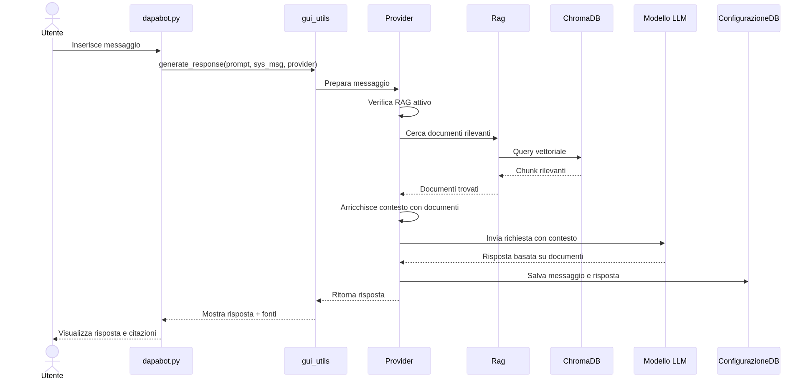
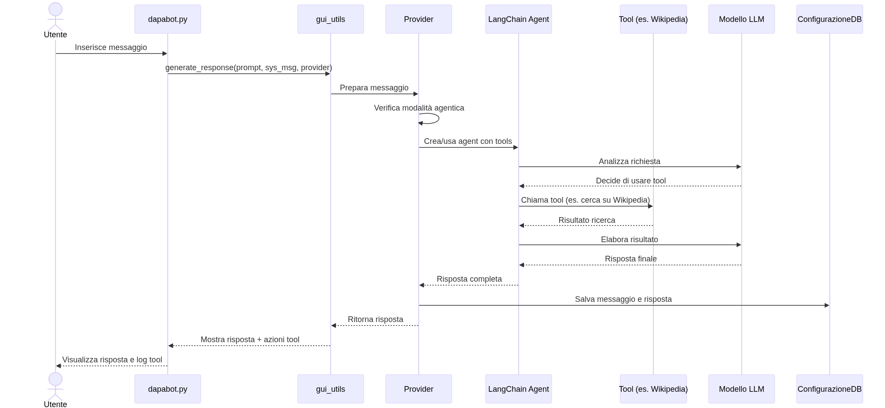
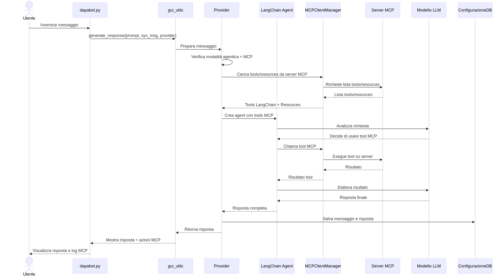
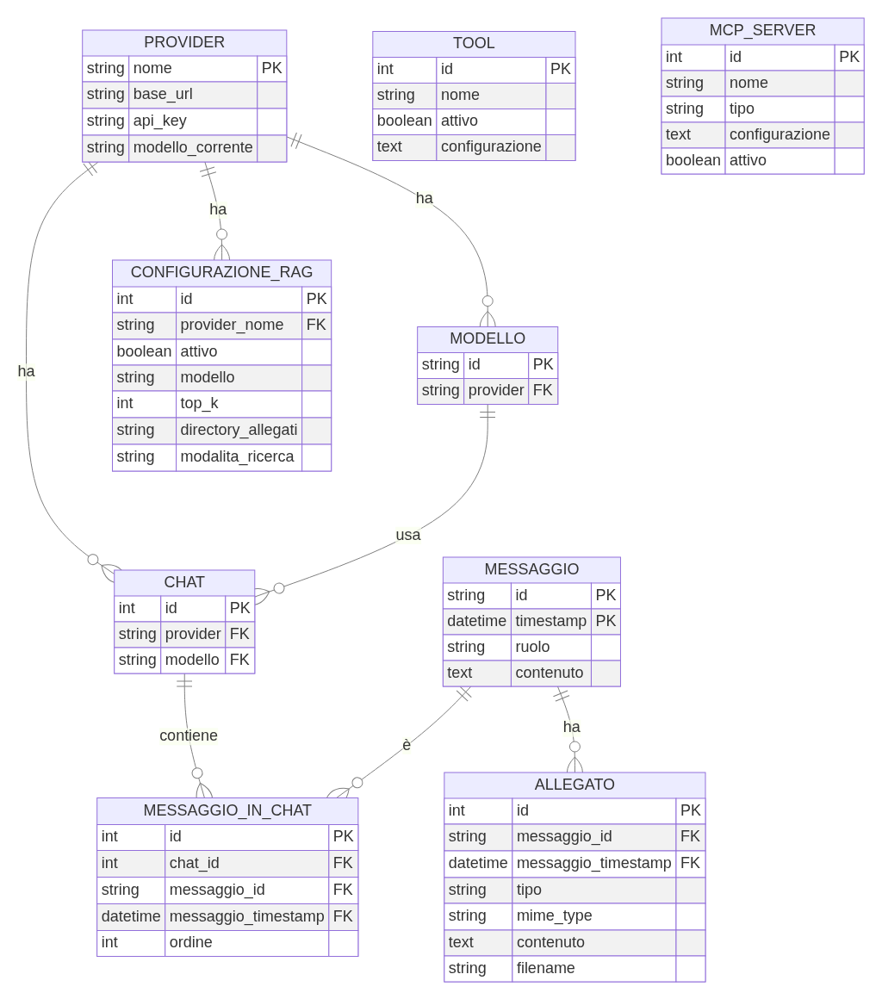

# Manuale Utente DAPABot

## Indice

1. [Introduzione](#1-introduzione)
   - 1.1 [Cos'è DAPABot](#11-cosè-dapabot)
   - 1.2 [Tecnologie utilizzate](#12-tecnologie-utilizzate)
2. [Installazione](#2-installazione)
   - 2.1 [Installazione in locale](#21-installazione-in-locale)
   - 2.2 [Installazione con Podman/Docker](#22-installazione-con-podmandocker)
3. [Usare DAPABot](#3-usare-dapabot)
   - 3.1 [Gestione Chat](#31-gestione-chat)
   - 3.2 [RAG (Retrieval Augmented Generation)](#32-rag-retrieval-augmented-generation)
   - 3.3 [Modalità Agentica](#33-modalità-agentica)
4. [Guida per lo Sviluppatore](#4-guida-per-lo-sviluppatore)
   - 4.1 [Componenti principali](#41-componenti-principali)
   - 4.2 [Diagrammi di sequenza](#42-diagrammi-di-sequenza)
   - 4.3 [Estendere DAPABot](#43-estendere-dapabot)
5. [Appendice](#5-appendice)
   - 5.1 [Struttura del Database](#51-struttura-del-database)

---

## 1. Introduzione

### 1.1 Cos'è DAPABot

**DAPABot** è un chatbot avanzato che si distingue per tre caratteristiche fondamentali:

- **Multimodello**: Supporta l'utilizzo di diversi modelli di linguaggio (LLM) all'interno della stessa applicazione
- **Multiprovider**: Si integra con diversi provider di servizi AI (HuggingFace, OpenRouter, Replicate)
- **Multimodale**: Gestisce non solo testo, ma anche immagini, video, audio e documenti

DAPABot è progettato per essere una soluzione completa e flessibile per l'interazione con modelli di linguaggio di grandi dimensioni, offrendo funzionalità avanzate come:

- **RAG (Retrieval Augmented Generation)**: Arricchisce le risposte del modello con informazioni estratte da documenti caricati dall'utente
- **Modalità Agentica**: Permette ai modelli di utilizzare strumenti esterni (tools) per eseguire azioni come ricerche su Wikipedia, GitHub, arXiv, o accedere al filesystem
- **Integrazione MCP**: Supporta il protocollo Model Context Protocol per estendere le capacità del chatbot con server esterni

### 1.2 Tecnologie utilizzate

DAPABot è costruito utilizzando tecnologie moderne e consolidate:

#### LangChain
[LangChain](https://www.langchain.com/) è il framework principale utilizzato per:
- Gestire le interazioni con i modelli di linguaggio
- Implementare la catena di elaborazione dei messaggi
- Gestire la memoria conversazionale
- Integrare i tools e gli agenti

#### Streamlit
[Streamlit](https://streamlit.io/) fornisce l'interfaccia utente web:
- Framework Python per creare applicazioni web interattive
- Interfaccia reattiva e moderna
- Facile da usare e personalizzare

#### Python
Il linguaggio di programmazione principale:
- Versione richiesta: Python 3.13 o superiore
- Gestione delle dipendenze con `uv`
- Architettura modulare e estensibile

#### Docling
[Docling](https://github.com/DS4SD/docling) è utilizzato per:
- Estrazione di testo da documenti PDF
- Conversione di documenti DOCX
- Supporto OCR per documenti scansionati
- Elaborazione di documenti complessi con tabelle e immagini

#### Peewee ORM
[Peewee](http://docs.peewee-orm.com/) gestisce la persistenza dei dati:
- ORM leggero per SQLite
- Gestione della configurazione
- Storico delle conversazioni
- Configurazione dei tools e server MCP

#### Altri componenti chiave
- **ChromaDB**: Vector database per il RAG
- **Sentence Transformers**: Modelli di embedding per la ricerca semantica
- **SQLite-Web**: Interfaccia web per esplorare il database
- **MCP (Model Context Protocol)**: Protocollo per estendere le capacità del chatbot

---

## 2. Installazione

DAPABot può essere installato in due modalità: localmente sul proprio sistema o tramite container Docker/Podman.

### 2.1 Installazione in locale

#### Prerequisiti

- Python 3.13 o superiore
- Git
- Visual Studio Code (consigliato)

#### Passo 1: Clonare il repository

```bash
git clone https://github.com/tuouser/Dapabot.git
cd Dapabot
```

#### Passo 2: Creare l'ambiente virtuale

DAPABot utilizza `uv` per la gestione delle dipendenze. Se non hai `uv` installato:

```bash
# Installa uv
pip install uv

# Crea l'ambiente virtuale e installa le dipendenze
uv sync
```

Questo comando creerà automaticamente un ambiente virtuale nella directory `.venv` e installerà tutte le dipendenze necessarie.

#### Passo 3: Configurare VS Code

1. Apri la cartella del progetto in VS Code
2. Seleziona l'interprete Python dall'ambiente virtuale:
   - Premi `Ctrl+Shift+P` (o `Cmd+Shift+P` su Mac)
   - Digita "Python: Select Interpreter"
   - Seleziona l'interprete in `.venv/bin/python`

3. Crea una configurazione di debug (opzionale):

Crea il file `.vscode/launch.json`:

```json
{
    "version": "0.2.0",
    "configurations": [
        {
            "name": "Python: Streamlit",
            "type": "python",
            "request": "launch",
            "module": "streamlit",
            "args": [
                "run",
                "dapabot.py",
                "--server.port=8501"
            ],
            "console": "integratedTerminal",
            "justMyCode": false
        }
    ]
}
```

#### Passo 4: Avviare DAPABot

Dalla directory del progetto, esegui:

```bash
# Attiva l'ambiente virtuale (se non già attivo)
source .venv/bin/activate  # Linux/Mac
# oppure
.venv\Scripts\activate  # Windows

# Avvia l'applicazione
uv run streamlit run dapabot.py
```

Oppure, se hai configurato VS Code, premi `F5` per avviare in modalità debug.

#### Passo 5: Accedere all'interfaccia web

Apri il browser all'indirizzo:
```
http://localhost:8501
```

DAPABot avvierà anche automaticamente SQLite-Web sulla porta 6969 per esplorare il database:
```
http://localhost:6969
```

### 2.2 Installazione con Podman/Docker

#### Prerequisiti

- Docker o Podman installato sul sistema
- Git (per clonare il repository)

#### Opzione A: Scaricare l'immagine da GitHub Container Registry

```bash
# Con Docker
docker pull ghcr.io/tuouser/dapabot:latest

# Con Podman
podman pull ghcr.io/tuouser/dapabot:latest
```

#### Opzione B: Build dell'immagine dal Containerfile

1. Clona il repository:

```bash
git clone https://github.com/tuouser/Dapabot.git
cd Dapabot
```

2. Costruisci l'immagine:

```bash
# Con Docker
docker build -t dapabot:latest -f Containerfile .

# Con Podman
podman build -t dapabot:latest -f Containerfile .
```

**Nota**: Il Containerfile è configurato per scaricare le dipendenze al primo avvio. Se preferisci creare un'immagine con tutte le dipendenze già incluse (circa 9GB), decommenta la riga 14 nel Containerfile:

```dockerfile
# Decommentare per includere tutte le dipendenze nell'immagine
RUN uv sync
```

#### Avviare il container

```bash
# Con Docker
docker run -d \
  --name dapabot \
  -p 8501:8501 \
  -p 6969:6969 \
  -v $(pwd)/config.db:/app/dapabot/config.db \
  -v $(pwd)/uploads:/app/dapabot/uploads \
  dapabot:latest

# Con Podman
podman run -d \
  --name dapabot \
  -p 8501:8501 \
  -p 6969:6969 \
  -v $(pwd)/config.db:/app/dapabot/config.db:Z \
  -v $(pwd)/uploads:/app/dapabot/uploads:Z \
  dapabot:latest
```

**Spiegazione dei parametri**:
- `-d`: Esegue il container in background
- `--name dapabot`: Assegna un nome al container
- `-p 8501:8501`: Espone la porta di Streamlit
- `-p 6969:6969`: Espone la porta di SQLite-Web
- `-v`: Monta volumi per persistere dati e configurazioni
- `:Z`: (solo Podman) Etichetta SELinux per il volume

#### Accedere all'interfaccia web

Apri il browser all'indirizzo:
```
http://localhost:8501
```

#### Gestione del container

```bash
# Fermare il container
docker stop dapabot  # o podman stop dapabot

# Avviare il container
docker start dapabot  # o podman start dapabot

# Visualizzare i log
docker logs -f dapabot  # o podman logs -f dapabot

# Rimuovere il container
docker rm -f dapabot  # o podman rm -f dapabot
```

---

## 3. Usare DAPABot

Questa sezione descrive come utilizzare le funzionalità principali di DAPABot attraverso l'interfaccia web.

### Interfaccia principale

L'interfaccia di DAPABot è divisa in due aree principali:

1. **Sidebar (barra laterale sinistra)**: Contiene tutti i controlli di configurazione
2. **Area principale**: Mostra la conversazione e permette di inviare messaggi

#### Componenti della Sidebar

La sidebar contiene i seguenti elementi:

1. **Selezione Provider**: Tab per scegliere tra i provider disponibili (HuggingFace, OpenRouter, Replicate)
2. **API Key**: Campo per inserire la chiave API del provider selezionato
3. **Modello**: Menu a tendina per selezionare il modello LLM da utilizzare
4. **Messaggio di sistema**: Area di testo per definire il comportamento del modello
5. **Gestione Chat**: Expander per salvare, caricare ed esportare conversazioni
6. **Modalità Agentica**: Expander per configurare tools e server MCP
7. **RAG**: Expander per caricare documenti e configurare la ricerca semantica

### Primo utilizzo

#### 1. Inserire un'API Key

Per iniziare a usare DAPABot, è necessario inserire una chiave API valida:

1. Seleziona il provider desiderato dalla tab in alto (es. "HuggingFace")
2. Nel campo "🔑 API Key", inserisci la tua chiave API
3. Clicca sull'icona dell'occhio per verificare che la chiave sia stata inserita correttamente

**Esempio di API Key**:
- HuggingFace: `hf_xxxxxxxxxxxxxxxxxxxxx`
- OpenRouter: `sk-or-v1-xxxxxxxxxxxxxxxxxxxxx`

#### 2. Scegliere un modello

Dopo aver inserito l'API Key:

1. Clicca sul menu a tendina "🧠 Modello"
2. Attendi che venga caricata la lista dei modelli disponibili
3. Seleziona il modello desiderato (es. "deepseek-ai/DeepSeek-V3")

**Nota**: La lista dei modelli viene caricata automaticamente dal provider selezionato.

#### 3. Inviare il primo messaggio

1. Nella casella di input in basso, digita il tuo messaggio
2. Premi `Invio` o clicca sul pulsante di invio
3. Attendi la risposta del modello

**Esempio di primo messaggio**:
```
Ciao! Puoi spiegarmi cosa sai fare?
```

Il modello risponderà descrivendo le sue capacità e come può aiutarti.

### 3.1 Gestione Chat

L'expander "💬 Gestione chat" permette di gestire le conversazioni salvate.

#### Funzionalità disponibili

##### Salvare una conversazione

1. Apri l'expander "💬 Gestione chat"
2. La conversazione corrente viene salvata automaticamente nel database
3. Ogni messaggio è associato al provider e al modello utilizzato

##### Caricare una conversazione precedente

1. Apri l'expander "💬 Gestione chat"
2. Attiva il checkbox "📖 Visualizza chat dal DB"
3. Seleziona la conversazione desiderata dal menu a tendina
4. La conversazione verrà caricata nell'area principale

##### Eliminare una conversazione

1. Carica la conversazione che vuoi eliminare
2. Clicca sul pulsante "🗑️ Elimina chat corrente"
3. Conferma l'operazione

**Attenzione**: L'eliminazione è permanente e non può essere annullata.

##### Esportare una conversazione

DAPABot permette di esportare le conversazioni in diversi formati:

1. **Esporta in JSON**: Salva la conversazione in formato JSON strutturato
2. **Esporta in Markdown**: Crea un file Markdown leggibile
3. **Esporta in TXT**: Salva come testo semplice

**Esempio di file JSON esportato**:

```json
{
  "provider": "HuggingFace",
  "modello": "deepseek-ai/DeepSeek-V3",
  "timestamp": "2026-02-28T16:30:00",
  "messaggi": [
    {
      "ruolo": "user",
      "contenuto": "Ciao! Come stai?",
      "timestamp": "2026-02-28T16:30:00"
    },
    {
      "ruolo": "assistant",
      "contenuto": "Ciao! Sono un'intelligenza artificiale, quindi non ho stati d'animo, ma sono qui per aiutarti!",
      "timestamp": "2026-02-28T16:30:05"
    }
  ]
}
```

**Esempio di file Markdown esportato**:

```markdown
# Conversazione con DeepSeek-V3
**Provider**: HuggingFace  
**Data**: 28/02/2026 16:30

---

## 👤 Utente
Ciao! Come stai?

## 🤖 Assistente
Ciao! Sono un'intelligenza artificiale, quindi non ho stati d'animo, ma sono qui per aiutarti!
```

##### Importare una conversazione

Per importare una conversazione precedentemente esportata:

1. Clicca sul pulsante "📥 Importa chat"
2. Seleziona il file JSON da importare
3. La conversazione verrà caricata nel database e visualizzata

**Nota**: Solo i file JSON esportati da DAPABot possono essere importati.

##### Ripulire la chat corrente

Per iniziare una nuova conversazione:

1. Clicca sul pulsante "🧹 Ripulisci chat"
2. La cronologia verrà cancellata (solo dalla memoria, non dal database)
3. Puoi iniziare una nuova conversazione

### 3.2 RAG (Retrieval Augmented Generation)

Il RAG (Retrieval Augmented Generation) è una tecnica che permette di arricchire le risposte del modello con informazioni estratte da documenti caricati dall'utente.

#### Cos'è il RAG?

Il RAG funziona in tre fasi:

1. **Indicizzazione**: I documenti caricati vengono suddivisi in chunk (frammenti) e convertiti in vettori numerici (embeddings)
2. **Ricerca**: Quando l'utente invia una domanda, il sistema cerca i chunk più rilevanti nel database vettoriale
3. **Generazione**: I chunk trovati vengono aggiunti al contesto del modello, che genera una risposta basata su queste informazioni

#### Configurare il RAG

1. Apri l'expander "🔍 RAG"
2. Attiva il checkbox "Abilita RAG"
3. Configura i parametri:
   - **Modello di embedding**: Seleziona il modello per creare i vettori (default: `sentence-transformers/all-MiniLM-L6-v2`)
   - **Top K**: Numero di chunk da recuperare (default: 5)
   - **Modalità di ricerca**: Scegli tra "similarity" (similarità) o "mmr" (Maximum Marginal Relevance)

#### Caricare documenti

DAPABot supporta diversi formati di documento:

- **PDF**: Documenti PDF con testo e immagini
- **DOCX**: Documenti Microsoft Word
- **TXT**: File di testo semplice
- **Immagini**: PNG, JPG (con OCR)

**Procedura**:

1. Clicca sul pulsante "📄 Carica documenti"
2. Seleziona uno o più file dal tuo computer
3. Attendi che i documenti vengano elaborati e indicizzati
4. I documenti saranno disponibili per le ricerche

#### Esempio pratico: Caricare un PDF e fare domande

**Scenario**: Hai un PDF con le specifiche tecniche di un prodotto e vuoi fare domande su di esso.

1. **Carica il PDF**:
   - Apri l'expander "🔍 RAG"
   - Attiva "Abilita RAG"
   - Clicca su "📄 Carica documenti"
   - Seleziona il file PDF

2. **Attendi l'indicizzazione**:
   - DAPABot elaborerà il documento
   - Verrà mostrato un messaggio di conferma

3. **Fai una domanda**:
   ```
   Quali sono le specifiche tecniche del prodotto X?
   ```

4. **Ricevi la risposta**:
   - Il modello cercherà le informazioni nel PDF
   - La risposta includerà citazioni dal documento
   - Potrai vedere quali chunk sono stati utilizzati

#### Gestire i documenti caricati

- **Visualizzare i documenti**: La lista dei documenti caricati è visibile nell'expander RAG
- **Eliminare documenti**: Clicca sull'icona del cestino accanto al documento da rimuovere
- **Svuotare il database**: Clicca su "🗑️ Svuota database RAG" per eliminare tutti i documenti

### 3.3 Modalità Agentica

La modalità agentica permette ai modelli di utilizzare strumenti esterni (tools) per eseguire azioni e ottenere informazioni.

#### Cos'è un agente?

Un **agente** è un modello di linguaggio che può:
- Decidere autonomamente quali strumenti utilizzare
- Eseguire azioni in base al contesto
- Combinare i risultati di più strumenti
- Ragionare sui risultati ottenuti

#### Cosa sono i tools?

I **tools** sono funzioni che l'agente può chiamare per:
- Cercare informazioni (Wikipedia, arXiv, GitHub)
- Accedere al filesystem
- Eseguire calcoli
- Interagire con API esterne

#### Cosa sono i server MCP?

I **server MCP** (Model Context Protocol) sono servizi esterni che espongono:
- **Tools**: Funzioni che l'agente può chiamare
- **Resources**: Dati e informazioni accessibili
- **Prompts**: Template di prompt predefiniti

### 3.3.1 Tools

DAPABot include diversi tools nativi basati su LangChain.

#### Tools disponibili

1. **Wikipedia**: Cerca informazioni su Wikipedia
2. **arXiv**: Cerca articoli scientifici su arXiv
3. **GitHub**: Interagisce con repository GitHub
4. **Filesystem**: Legge e scrive file sul sistema

#### Configurare i tools

1. Apri l'expander "🤖 Modalità Agentica"
2. Clicca su "🛠️ Configura Tools"
3. Si aprirà una finestra di dialogo con la lista dei tools disponibili

#### Attivare un tool

1. Nella finestra di configurazione, trova il tool desiderato
2. Attiva il checkbox accanto al nome del tool
3. Se il tool richiede configurazione (es. API key), compila i campi necessari
4. Clicca su "Salva" per confermare

#### Esempio: Usare il tool Wikipedia

**Scenario**: Vuoi che l'agente cerchi informazioni su Wikipedia.

1. **Attiva il tool**:
   - Apri "🛠️ Configura Tools"
   - Attiva "Wikipedia"
   - Salva la configurazione

2. **Attiva la modalità agentica**:
   - Nell'expander "🤖 Modalità Agentica"
   - Attiva il checkbox "Abilita modalità agentica"

3. **Fai una domanda**:
   ```
   Chi era Alan Turing? Cerca informazioni su Wikipedia.
   ```

4. **Osserva il comportamento**:
   - L'agente deciderà di usare il tool Wikipedia
   - Cercherà le informazioni
   - Elaborerà i risultati
   - Fornirà una risposta completa

#### Esempio: Usare il tool arXiv

**Scenario**: Vuoi cercare articoli scientifici su un argomento specifico.

1. **Attiva il tool arXiv**
2. **Attiva la modalità agentica**
3. **Fai una domanda**:
   ```
   Trova gli ultimi articoli su arXiv riguardo il machine learning quantistico.
   ```

L'agente cercherà su arXiv e riassumerà i risultati trovati.

### 3.3.2 Configurazione MCP

Il protocollo MCP (Model Context Protocol) permette di estendere le capacità di DAPABot con server esterni.

#### Cos'è il protocollo MCP?

MCP è un protocollo standard per:
- Connettere modelli di linguaggio a fonti di dati esterne
- Esporre tools, resources e prompts in modo standardizzato
- Permettere l'integrazione con servizi di terze parti

#### Client e Server MCP

- **Client MCP**: DAPABot agisce come client, connettendosi ai server
- **Server MCP**: Servizi esterni che espongono funzionalità tramite MCP

#### Configurare un server MCP locale

Un server MCP locale è un processo che gira sulla stessa macchina di DAPABot.

**Esempio: Server filesystem locale**

1. Apri l'expander "🤖 Modalità Agentica"
2. Clicca su "⚙️ Configura MCP"
3. Clicca su "➕ Aggiungi Server"
4. Compila i campi:
   - **Nome**: `filesystem-local`
   - **Tipo**: `Local`
   - **Comando**: `npx`
   - **Argomenti**: `@modelcontextprotocol/server-filesystem /path/to/directory`
   - **Variabili d'ambiente**: (opzionale)

5. Clicca su "Salva"

#### Configurare un server MCP remoto

Un server MCP remoto è un servizio accessibile via rete.

**Esempio: Server API remoto**

1. Apri "⚙️ Configura MCP"
2. Clicca su "➕ Aggiungi Server"
3. Compila i campi:
   - **Nome**: `api-server`
   - **Tipo**: `Remote`
   - **URL**: `https://api.example.com/mcp`
   - **Headers**: (opzionale, es. per autenticazione)

4. Clicca su "Salva"

#### Testare la connessione

Dopo aver configurato un server:

1. Clicca sul pulsante "🔌 Testa connessione" accanto al server
2. DAPABot tenterà di connettersi
3. Verrà mostrato un messaggio di successo o errore

### 3.3.3 Esplora Server MCP

La finestra "Esplora Server MCP" permette di visualizzare cosa offre ogni server configurato.

#### Aprire la finestra di esplorazione

1. Apri l'expander "🤖 Modalità Agentica"
2. Clicca su "🔍 Esplora Server MCP"
3. Si aprirà una finestra di dialogo

#### Cosa puoi vedere

Per ogni server MCP configurato, puoi visualizzare:

1. **Tools disponibili**:
   - Nome del tool
   - Descrizione
   - Parametri richiesti
   - Esempi di utilizzo

2. **Resources disponibili**:
   - URI della risorsa
   - Tipo di contenuto
   - Descrizione

3. **Prompts disponibili**:
   - Nome del prompt
   - Descrizione
   - Parametri
   - Template

#### Esempio di esplorazione

**Scenario**: Hai configurato un server MCP per GitHub e vuoi vedere cosa offre.

1. Apri "🔍 Esplora Server MCP"
2. Seleziona il server "github-mcp"
3. Visualizzi:
   - **Tools**: `search_repositories`, `get_file_contents`, `create_issue`
   - **Resources**: `repository://owner/repo`, `file://owner/repo/path`
   - **Prompts**: `create_pr_description`, `review_code`

4. Puoi testare un tool direttamente dalla finestra
5. Chiudi la finestra quando hai finito

---

## 4. Guida per lo Sviluppatore

Questa sezione è dedicata agli sviluppatori che vogliono comprendere l'architettura di DAPABot e contribuire al progetto.

### 4.1 Componenti principali

DAPABot è strutturato in moduli ben definiti che seguono il principio di separazione delle responsabilità.

#### Architettura generale


#### Descrizione dei componenti

##### 1. Entry Point e GUI

- **`dapabot.py`**: Punto di ingresso dell'applicazione Streamlit
  - Inizializza l'applicazione
  - Gestisce il ciclo di vita della sessione
  - Avvia sqlite-web in background

- **`gui_utils.py`**: Funzioni di utilità per l'interfaccia
  - `inizializza()`: Bootstrap dell'applicazione
  - `crea_sidebar()`: Crea la barra laterale
  - `generate_response()`: Gestisce l'invio dei messaggi
  - `mostra_cronologia_chat()`: Visualizza la cronologia

##### 2. Providers

- **`base.py`**: Classe astratta `Provider`
  - Definisce l'interfaccia comune per tutti i provider
  - Gestisce la cronologia dei messaggi
  - Implementa la logica RAG e agentica

- **Provider specifici**:
  - `huggingface.py`: Integrazione con HuggingFace
  - `openrouter.py`: Integrazione con OpenRouter
  - `replicate.py`: Integrazione con Replicate

- **`loader.py`**: Caricamento dinamico dei provider
  - Scopre automaticamente i provider disponibili
  - Istanzia i provider con la configurazione dal DB

##### 3. RAG (Retrieval Augmented Generation)

- **`rag.py`**: Classe `Rag`
  - Gestisce il caricamento e l'indicizzazione dei documenti
  - Implementa la ricerca semantica con ChromaDB
  - Supporta diversi formati di documento tramite Docling

##### 4. Tools

- **`Tool.py`**: Classe astratta `Tool`
  - Definisce l'interfaccia per i tools
  - Gestisce la configurazione e validazione

- **Tools specifici**:
  - `Wikipedia.py`: Ricerca su Wikipedia
  - `Arxiv.py`: Ricerca articoli scientifici
  - `Github.py`: Interazione con GitHub
  - `Filesystem.py`: Accesso al filesystem

- **`loader.py`**: Caricamento dinamico dei tools

##### 5. MCP (Model Context Protocol)

- **`client.py`**: `MCPClientManager`
  - Gestisce le connessioni ai server MCP
  - Mantiene lo stato delle connessioni
  - Carica la configurazione dal DB

- **`langchain_adapter.py`**: Adapter per LangChain
  - Converte tools MCP in tools LangChain
  - Gestisce resources e prompts MCP

- **`gui_mcp.py`**: Interfaccia GUI per MCP
  - Configurazione server MCP
  - Test connessioni

##### 6. Database

- **`ConfigurazioneDB.py`**: Classe `ConfigurazioneDB`
  - API unificata per accesso al database
  - Gestisce provider, chat, tools, MCP

- **`models/`**: Modelli Peewee ORM
  - `base.py`: Configurazione database
  - `provider.py`: Modello provider
  - `chat.py`: Modello chat
  - `messaggio.py`: Modello messaggio
  - Altri modelli per allegati, tools, MCP

### 4.2 Diagrammi di sequenza

I diagrammi seguenti mostrano il flusso di esecuzione per i casi d'uso principali.

#### 4.2.1 Invio di un messaggio semplice





**Spiegazione**:
1. L'utente inserisce un messaggio nell'interfaccia
2. `generate_response()` prepara il messaggio
3. Il `Provider` aggiunge il messaggio alla cronologia
4. Il messaggio viene inviato al modello LLM
5. La risposta viene salvata nel database
6. La risposta viene mostrata all'utente

#### 4.2.2 Invio di un messaggio con RAG





**Spiegazione**:
1. L'utente invia un messaggio con RAG attivo
2. Il `Provider` verifica che RAG sia abilitato
3. `Rag` cerca i documenti rilevanti in ChromaDB
4. I chunk trovati vengono aggiunti al contesto
5. Il modello genera una risposta basata sui documenti
6. La risposta include citazioni dalle fonti

#### 4.2.3 Invio di un messaggio con Tools





**Spiegazione**:
1. L'utente invia un messaggio con modalità agentica attiva
2. Il `Provider` crea o usa un agent LangChain
3. L'agent analizza la richiesta e decide quali tools usare
4. I tools vengono chiamati e ritornano risultati
5. L'agent elabora i risultati e genera la risposta finale
6. La risposta include i log delle azioni eseguite

#### 4.2.4 Invio di un messaggio con Server MCP





**Spiegazione**:
1. L'utente invia un messaggio con modalità agentica e MCP attivi
2. Il `Provider` carica i tools dai server MCP configurati
3. `MCPClientManager` si connette ai server e recupera tools/resources
4. I tools MCP vengono convertiti in tools LangChain
5. L'agent usa i tools MCP per eseguire azioni sui server esterni
6. La risposta include i log delle azioni MCP eseguite

### 4.3 Estendere DAPABot

DAPABot è progettato per essere facilmente estensibile. Questa sezione spiega come aggiungere nuovi provider e tools.

#### 4.3.1 Implementare un nuovo Provider

Per aggiungere un nuovo provider, segui questi passaggi:

**1. Crea un nuovo file in `src/providers/`**

Esempio: `src/providers/anthropic.py`

```python
from src.providers.base import Provider
from langchain_anthropic import ChatAnthropic

class AnthropicProvider(Provider):
    def __init__(self):
        super().__init__(
            nome="Anthropic",
            base_url="https://api.anthropic.com/v1",
            prefisso_token="sk-ant-"
        )
    
    def lista_modelli(self):
        """Ritorna la lista dei modelli disponibili"""
        # Implementa la logica per recuperare i modelli
        return [
            "claude-3-opus-20240229",
            "claude-3-sonnet-20240229",
            "claude-3-haiku-20240307"
        ]
    
    def crea_client(self):
        """Crea il client per il provider"""
        self._client = ChatAnthropic(
            api_key=self._api_key,
            model=self._modello_scelto
        )
        return self._client
    
    def disponibile(self):
        """Verifica se il provider è disponibile"""
        try:
            self.lista_modelli()
            self.set_disponibile(True)
            return True
        except Exception:
            self.set_disponibile(False)
            return False
```

**2. Il provider verrà caricato automaticamente**

Il `Loader` in `src/providers/loader.py` scopre automaticamente tutti i provider nella directory `src/providers/`.

**3. Testa il nuovo provider**

1. Avvia DAPABot
2. Seleziona il nuovo provider dalla tab
3. Inserisci l'API key
4. Seleziona un modello
5. Invia un messaggio di prova

#### 4.3.2 Implementare un nuovo Tool

Per aggiungere un nuovo tool, segui questi passaggi:

**1. Scegli un tool da LangChain**

Consulta la [documentazione di LangChain](https://python.langchain.com/docs/integrations/tools/) per vedere i tools disponibili.

Esempio: Implementiamo il tool DuckDuckGo Search.

**2. Crea un nuovo file in `src/tools/`**

Esempio: `src/tools/DuckDuckGo.py`

```python
from src.tools.Tool import Tool
from langchain_community.tools import DuckDuckGoSearchRun

class DuckDuckGoTool(Tool):
    def __init__(self):
        super().__init__(
            nome="DuckDuckGo",
            descrizione="Cerca informazioni su DuckDuckGo",
            icona="🦆"
        )
        # Definisci le variabili necessarie (se richieste)
        self._variabili_necessarie = {}
    
    def get_tool(self):
        """Ritorna il tool LangChain"""
        # Crea e ritorna il tool
        tool = DuckDuckGoSearchRun()
        return [tool]  # Ritorna sempre una lista
    
    def valida_configurazione(self):
        """Valida la configurazione del tool"""
        # Implementa la validazione se necessario
        return True
```

**3. Aggiungi dipendenze se necessarie**

Se il tool richiede dipendenze aggiuntive, aggiungile a `pyproject.toml`:

```bash
uv add duckduckgo-search
```

**4. Il tool verrà caricato automaticamente**

Il `Loader` in `src/tools/loader.py` scopre automaticamente tutti i tools nella directory `src/tools/`.

**5. Testa il nuovo tool**

1. Avvia DAPABot
2. Apri "🛠️ Configura Tools"
3. Attiva il nuovo tool "DuckDuckGo"
4. Attiva la modalità agentica
5. Fai una domanda che richiede una ricerca web

**Esempio di tool con configurazione**:

```python
from src.tools.Tool import Tool
from langchain_community.tools import OpenWeatherMapQueryRun
from langchain_community.utilities import OpenWeatherMapAPIWrapper

class WeatherTool(Tool):
    def __init__(self):
        super().__init__(
            nome="Weather",
            descrizione="Ottieni informazioni meteo",
            icona="🌤️"
        )
        # Definisci le variabili necessarie
        self._variabili_necessarie = {
            "api_key": {
                "tipo": "password",
                "descrizione": "API Key di OpenWeatherMap",
                "obbligatorio": True
            }
        }
        self.api_key = ""
    
    def get_tool(self):
        """Ritorna il tool LangChain"""
        if not self.api_key:
            raise ValueError("API Key mancante")
        
        wrapper = OpenWeatherMapAPIWrapper(
            openweathermap_api_key=self.api_key
        )
        tool = OpenWeatherMapQueryRun(api_wrapper=wrapper)
        return [tool]
    
    def valida_configurazione(self):
        """Valida la configurazione del tool"""
        if not self.api_key:
            return False
        return True
```

---

## 5. Appendice

### 5.1 Struttura del Database

DAPABot utilizza SQLite come database per memorizzare configurazioni, cronologia chat, e altre informazioni. Il database è gestito tramite Peewee ORM.

#### Schema del Database





#### Descrizione delle tabelle

##### 1. PROVIDER
Memorizza la configurazione dei provider di modelli LLM.

**Campi**:
- `nome` (PK): Nome del provider (es. "HuggingFace", "OpenRouter")
- `base_url`: URL base del provider
- `api_key`: Chiave API per l'autenticazione
- `modello_corrente`: Modello attualmente selezionato

##### 2. CONFIGURAZIONE_RAG
Memorizza la configurazione RAG per ogni provider.

**Campi**:
- `id` (PK): Identificatore univoco
- `provider_nome` (FK): Riferimento al provider
- `attivo`: Se il RAG è abilitato
- `modello`: Modello di embedding utilizzato
- `top_k`: Numero di chunk da recuperare
- `directory_allegati`: Directory per i file caricati
- `modalita_ricerca`: Modalità di ricerca ("similarity" o "mmr")

##### 3. MODELLO
Memorizza i modelli disponibili per ogni provider.

**Campi**:
- `id` (PK): Identificatore del modello (es. "deepseek-ai/DeepSeek-V3")
- `provider` (FK): Riferimento al provider

##### 4. CHAT
Rappresenta una sessione di chat tra un provider e un modello.

**Campi**:
- `id` (PK): Identificatore univoco della chat
- `provider` (FK): Riferimento al provider
- `modello` (FK): Riferimento al modello

**Vincolo**: Combinazione unica di provider e modello.

##### 5. MESSAGGIO
Memorizza i messaggi individuali.

**Campi**:
- `id` (PK): Identificatore del messaggio
- `timestamp` (PK): Timestamp del messaggio (parte della chiave primaria composita)
- `ruolo`: Ruolo del messaggio ("user", "assistant", "system")
- `contenuto`: Contenuto testuale del messaggio

##### 6. MESSAGGIO_IN_CHAT
Tabella di associazione tra chat e messaggi.

**Campi**:
- `id` (PK): Identificatore univoco
- `chat_id` (FK): Riferimento alla chat
- `messaggio_id` (FK): Riferimento al messaggio
- `messaggio_timestamp` (FK): Timestamp del messaggio
- `ordine`: Ordine del messaggio nella chat

##### 7. ALLEGATO
Memorizza gli allegati associati ai messaggi.

**Campi**:
- `id` (PK): Identificatore univoco
- `messaggio_id` (FK): Riferimento al messaggio
- `messaggio_timestamp` (FK): Timestamp del messaggio
- `tipo`: Tipo di allegato ("image", "video", "audio", "file")
- `mime_type`: Tipo MIME del file
- `contenuto`: Contenuto codificato in base64
- `filename`: Nome del file originale

##### 8. TOOL
Memorizza la configurazione dei tools.

**Campi**:
- `id` (PK): Identificatore univoco
- `nome`: Nome del tool
- `attivo`: Se il tool è abilitato
- `configurazione`: Configurazione JSON del tool

##### 9. MCP_SERVER
Memorizza la configurazione dei server MCP.

**Campi**:
- `id` (PK): Identificatore univoco
- `nome`: Nome del server
- `tipo`: Tipo di server ("Local" o "Remote")
- `configurazione`: Configurazione JSON del server
- `attivo`: Se il server è abilitato

#### Utilizzo di Peewee nel codice

DAPABot utilizza Peewee ORM per interagire con il database. Ecco alcuni esempi di utilizzo:

**1. Definizione di un modello**:

```python
from peewee import CharField, ForeignKeyField
from src.models.base import BaseModel
from src.models.provider import ProviderModel

class ModelloModel(BaseModel):
    """Rappresenta un modello LLM disponibile per un provider"""
    id = CharField(primary_key=True, max_length=200)
    provider = ForeignKeyField(ProviderModel, backref='modelli', on_delete='CASCADE')
    
    class Meta:
        table_name = 'modello'
```

**2. Salvare un provider**:

```python
from src.ConfigurazioneDB import ConfigurazioneDB

ConfigurazioneDB.salva_provider(
    nome="HuggingFace",
    base_url="https://api-inference.huggingface.co/v1",
    api_key="hf_xxxxxxxxxxxxx",
    modello="deepseek-ai/DeepSeek-V3",
    rag_config={
        "attivo": True,
        "modello": "sentence-transformers/all-MiniLM-L6-v2",
        "top_k": 5,
        "directory_allegati": "uploads",
        "modalita_ricerca": "similarity"
    }
)
```

**3. Caricare la configurazione di un provider**:

```python
from src.ConfigurazioneDB import ConfigurazioneDB

config = ConfigurazioneDB.carica_provider("HuggingFace")
print(config)
# Output:
# {
#     'nome': 'HuggingFace',
#     'base_url': 'https://api-inference.huggingface.co/v1',
#     'api_key': 'hf_xxxxxxxxxxxxx',
#     'modello': 'deepseek-ai/DeepSeek-V3',
#     'rag': {
#         'attivo': True,
#         'modello': 'sentence-transformers/all-MiniLM-L6-v2',
#         'top_k': 5,
#         'directory_allegati': 'uploads',
#         'modalita_ricerca': 'similarity'
#     }
# }
```

**4. Salvare un messaggio nella cronologia**:

```python
from src.ConfigurazioneDB import ConfigurazioneDB
from src.Messaggio import Messaggio

messaggio = Messaggio(
    id="msg_001",
    ruolo="user",
    testo="Ciao! Come stai?"
)

ConfigurazioneDB.salva_messaggio(
    provider_nome="HuggingFace",
    modello_id="deepseek-ai/DeepSeek-V3",
    messaggio=messaggio
)
```

**5. Caricare la cronologia di una chat**:

```python
from src.ConfigurazioneDB import ConfigurazioneDB

messaggi = ConfigurazioneDB.carica_cronologia(
    provider_nome="HuggingFace",
    modello_id="deepseek-ai/DeepSeek-V3"
)

for msg in messaggi:
    print(f"{msg.get_ruolo()}: {msg.get_testo()}")
```

**6. Gestire i tools**:

```python
from src.ConfigurazioneDB import ConfigurazioneDB

# Salvare la configurazione di un tool
ConfigurazioneDB.salva_tool(
    nome="Wikipedia",
    attivo=True,
    configurazione={}
)

# Caricare i tools attivi
tools_attivi = ConfigurazioneDB.carica_tools_attivi()
for tool in tools_attivi:
    print(f"Tool: {tool['nome_tool']}, Config: {tool['configurazione']}")
```

**7. Gestire i server MCP**:

```python
from src.ConfigurazioneDB import ConfigurazioneDB

# Salvare la configurazione di un server MCP
ConfigurazioneDB.salva_mcp_server(
    nome="filesystem-local",
    tipo="Local",
    configurazione={
        "command": "npx",
        "args": ["@modelcontextprotocol/server-filesystem", "/path/to/dir"],
        "env": {}
    },
    attivo=True
)

# Caricare i server MCP attivi
servers = ConfigurazioneDB.carica_mcp_servers_attivi()
for server in servers:
    print(f"Server: {server['nome']}, Tipo: {server['tipo']}")
```

#### Backup e Ripristino

Il database `config.db` può essere facilmente salvato e ripristinato:

**Backup**:
```bash
# Copia il file del database
cp config.db config.db.backup

# Oppure usa sqlite3 per esportare
sqlite3 config.db .dump > backup.sql
```

**Ripristino**:
```bash
# Ripristina da file
cp config.db.backup config.db

# Oppure importa da SQL
sqlite3 config.db < backup.sql
```

#### Esplorazione del Database

DAPABot avvia automaticamente SQLite-Web per esplorare il database:

1. Avvia DAPABot
2. Apri il browser all'indirizzo: `http://localhost:6969`
3. Esplora le tabelle, esegui query SQL, visualizza i dati

---

## Conclusione

Questo manuale ha coperto tutti gli aspetti di DAPABot, dall'installazione all'utilizzo avanzato, fino allo sviluppo di estensioni. Per ulteriori informazioni o supporto, consulta:

- **Repository GitHub**: [https://github.com/tuouser/Dapabot](https://github.com/tuouser/Dapabot)
- **Documentazione LangChain**: [https://python.langchain.com/](https://python.langchain.com/)
- **Documentazione Streamlit**: [https://docs.streamlit.io/](https://docs.streamlit.io/)
- **Documentazione MCP**: [https://modelcontextprotocol.io/](https://modelcontextprotocol.io/)

Buon utilizzo di DAPABot! 🤖
